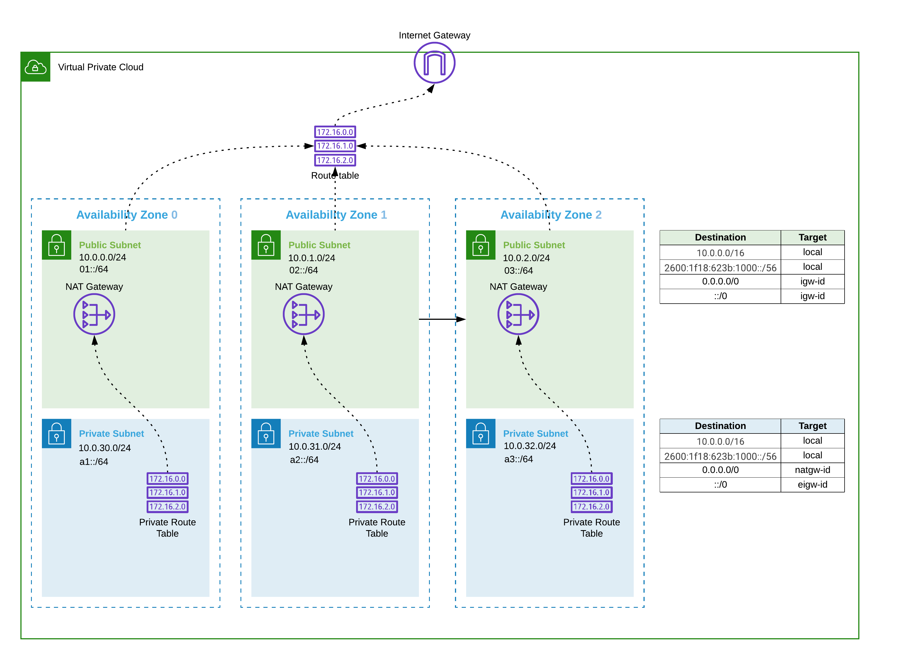

# rawr

# Overview

Quickly spin up HA Kubernetes and EKS stacks using AWS Cloudformation and Ansible

## AWS network architecture



## Kubernetes cluster architecture

## Prerequisites

Install ansible

```
brew install ansible
```

Install the awscli

```
brew install awscl
```

Configure awscli credentials

```
aws configure
```

Check to make sure you can authenticate to the AWS apis and you're in the right account

```
aws sts get-caller-identity
```

Create a `local-config.mk` file in the base directory to override the required make parameters

```console
$ cat local-config.mk
ENVNAME=sabo-demo
REGION=us-east-1
VPCCIDR=10.0.0.0/16
PRIVATENETWORKING=false
KEYNAME=sabo
IMAGEID=ami-0565af6e282977273
INSTANCETYPE=t3.large
EKSIMAGEID=ami-0b4eb1d8782fc3aea
EKSINSTANCETYPE=t3.large
ELBNAME=k8s.yao.financial
HOSTEDZONEID=Z1FI1N5HPAAV7G
```

# Usage

```console
$ make

Usage:
  make <target>

Manage base stacks.
  test_base        Test base stack.
  deploy_base      Deploy the base stack.
  teardown_base    Teardown the base stack.

Manage k8s environments.
  test_k8s        Test k8s stack.
  deploy_k8s      Deploy the k8s stack.
  teardown_k8s    Teardown the k8s stack.

Manage eks environments.
  test_eks         Test eks stack.
  deploy_eks       Deploy the eks stack.
  teardown_eks     Teardown the eks stack.

Help
  help             Type make followed by target you wish to run.
```

## Setup base networking environment

```
make deploy_base NAME=sabo-demo
```

## Deploying k8s stack

```
make deploy_k8s NAME=sabo-demo-k8s
```

## Deploying eks stack

```
make deploy_eks NAME=sabo-demo-eks
```

## Installing Kubernetes

### Kubespray

Refer to the [kubespray](https://github.com/kubernetes-sigs/kubespray/blob/master/docs/aws.md) docs for configuration

```
export REGION=us-east-1
export VPC_VISIBILITY=public
ansible-playbook -i inventory/kubespray-aws-inventory.py \
  --user ubuntu \
  --become \
  --become-user=root \
  cluster.yml
```

## Verifying things are working

```
ansible kube-master -i inventory/kubespray-aws-inventory.py \
  --user ubuntu \
  --become \
  --become-user=root \
  -m shell -a "kubectl --kubeconfig /etc/kubernetes/admin.conf get nodes"
```

## Tearing it down

```
make teardown_k8s NAME=sabo-demo-k8s
```

```
make teardown_eks NAME=sabo-demo-eks
```

```
make teardown_base NAME=sabo-demo
```